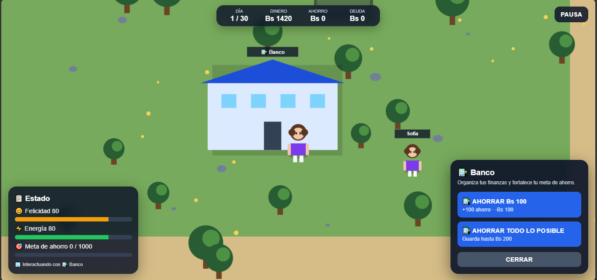
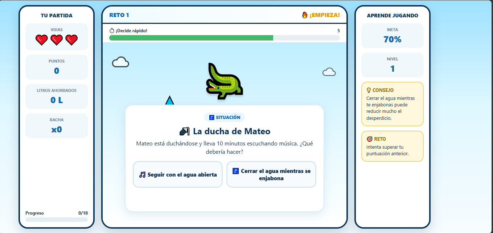
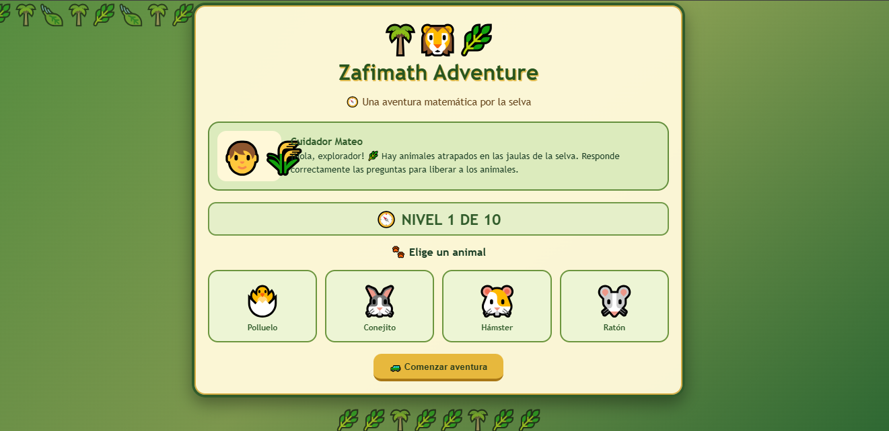

# 🎮 Game Development Portfolio

**Code • Create • Play**

Creando experiencias interactivas a través de código, creatividad y diseño.

---

## 👋 SOBRE MÍ

Hola, soy **Patty** y este es mi portafolio de **Game Development**.

Me interesa la **programación, el diseño de videojuegos y la creación de experiencias interactivas**. En este repositorio presento los proyectos y prototipos que desarrollé durante la asignatura de Game Development.

Cada proyecto representa una etapa de aprendizaje en la que experimenté con diferentes mecánicas, interfaces, escenarios, sistemas de juego e interacción con el jugador.

### 🎯 Mi objetivo

Seguir desarrollando mis habilidades para crear videojuegos cada vez más completos, originales e interactivos.

---

# 🎮 PROYECTOS DESTACADOS

<table>
<tr>

<td width="50%" align="center">

## 🍎 TURBOPLATO

### Misión Saludable

Juego arcade de acción rápida donde el jugador debe interactuar correctamente con diferentes alimentos para conseguir la mayor puntuación posible.

**🎨 Género:** Arcade

**💻 Tecnologías:** HTML5, CSS3, JavaScript

 

<a href="https://pattybln.github.io/game-development-portfolio/TURBOPLATO/">

<strong>🎮 JUGAR</strong>

</a>

  

<a href="./TURBOPLATO">

📂 Ver documentación

</a>

</td>

<td width="50%" align="center">

## 🌱 VIDA EN BALANCE

### Aventura y Simulación

Videojuego de exploración donde el jugador controla un personaje, recorre un mapa y administra recursos mediante diferentes decisiones.

**🎨 Género:** Adventure / Simulation

**💻 Tecnologías:** HTML5, CSS3, JavaScript

 

<a href="https://pattybln.github.io/game-development-portfolio/VIDA-EN-BALANCE/">

<strong>🎮 JUGAR</strong>

</a>

  

<a href="./VIDA-EN-BALANCE">

📂 Ver documentación

</a>

</td>

</tr>

<tr>

<td width="50%" align="center">

## 💧 RETO GOTA A GOTA

### Ahorro de Agua

Videojuego educativo e interactivo donde el jugador debe tomar decisiones rápidas para ahorrar agua, conseguir puntos y completar diferentes retos.

**🎨 Género:** Educativo / Arcade

**💻 Tecnologías:** HTML5, CSS3, JavaScript

 

<a href="https://pattybln.github.io/game-development-portfolio/AGUA/">

<strong>🎮 JUGAR</strong>

</a>

  

<a href="./AGUA">

📂 Ver documentación

</a>

</td>

<td width="50%" align="center">

## 🧮 ZAFIMATH ADVENTURE

### Aventura Matemática

Videojuego educativo ambientado en una selva donde el jugador debe resolver operaciones matemáticas para liberar animales atrapados.

**🎨 Género:** Educativo / Adventure / Puzzle

**💻 Tecnologías:** HTML5, CSS3, JavaScript

 

<a href="https://pattybln.github.io/game-development-portfolio/ZAFARI/">

<strong>🎮 JUGAR</strong>

</a>

  

<a href="./ZAFARI">

📂 Ver documentación

</a>

</td>

</tr>
</table>

---

# 🕹️ GALERÍA

## 🍎 TURBOPLATO — MISIÓN SALUDABLE

### 🎯 Descripción

TURBOPLATO es un videojuego arcade basado en velocidad y reacción. El jugador debe identificar los alimentos que aparecen en pantalla e interactuar con ellos para conseguir la mayor puntuación posible.

**Género:** Arcade

**Tecnologías:** HTML5, CSS3, JavaScript

<a href="https://pattybln.github.io/game-development-portfolio/TURBOPLATO/">

🎮 **JUGAR TURBOPLATO**

</a>

   

<a href="./TURBOPLATO">

📂 **VER DOCUMENTACIÓN**

</a>

---

## 🌱 VIDA EN BALANCE

### 🎯 Descripción

VIDA EN BALANCE es un videojuego de aventura y simulación donde el jugador controla un personaje, explora un mapa y administra diferentes recursos mediante sus decisiones.

**Género:** Adventure / Simulation

**Tecnologías:** HTML5, CSS3, JavaScript

<a href="https://pattybln.github.io/game-development-portfolio/VIDA-EN-BALANCE/">

🎮 **JUGAR VIDA EN BALANCE**

</a>

   

<a href="./VIDA-EN-BALANCE">

📂 **VER DOCUMENTACIÓN**

</a>

---

## 💧 RETO GOTA A GOTA

### 🎯 Descripción

**Reto Gota a Gota** es un videojuego educativo e interactivo en el que el jugador debe tomar decisiones rápidas relacionadas con el ahorro de agua.

El jugador debe resolver diferentes situaciones, conseguir puntos, ahorrar litros de agua, mantener rachas de respuestas correctas y completar los retos de la partida.

**Género:** Educativo / Arcade / Toma de decisiones

**Tecnologías:** HTML5, CSS3, JavaScript

<a href="https://pattybln.github.io/game-development-portfolio/AGUA/">

🎮 **JUGAR RETO GOTA A GOTA**

</a>

   

<a href="./AGUA">

📂 **VER DOCUMENTACIÓN**

</a>

---

## 🧮 ZAFIMATH ADVENTURE

### 🎯 Descripción

**Zafimath Adventure** es un videojuego educativo de aventura matemática ambientado en una selva.

El jugador debe resolver operaciones de suma, resta, multiplicación y división para liberar animales atrapados y completar los **10 niveles** de la aventura.

**Género:** Educativo / Adventure / Puzzle

**Tecnologías:** HTML5, CSS3, JavaScript

<a href="https://pattybln.github.io/game-development-portfolio/ZAFARI/">

🎮 **JUGAR ZAFIMATH ADVENTURE**

</a>

   

<a href="./ZAFARI">

📂 **VER DOCUMENTACIÓN**

</a>

---

# 🛠️ TECNOLOGÍAS Y HERRAMIENTAS

<table>
<tr>

<td width="50%" valign="top">

### 💻 DESARROLLO

| Tecnología     | Uso                             |
| -------------- | ------------------------------- |
| **HTML5**      | Estructura de los videojuegos   |
| **CSS3**       | Diseño visual e interfaces      |
| **JavaScript** | Mecánicas, interacción y lógica |

</td>

<td width="50%" valign="top">

### 🧰 HERRAMIENTAS

| Herramienta            | Uso                            |
| ---------------------- | ------------------------------ |
| **Visual Studio Code** | Desarrollo y edición           |
| **GitHub**             | Almacenamiento y organización  |
| **GitHub Pages**       | Publicación de los videojuegos |

</td>

</tr>
</table>

---

# 🤖 INTELIGENCIA ARTIFICIAL

Durante el desarrollo de los proyectos se utilizó **Inteligencia Artificial como herramienta de apoyo** para:

* 💡 Generación y mejora de ideas.
* 💻 Apoyo en programación.
* 🔧 Corrección y mejora de código.
* 🎮 Propuestas para las mecánicas.
* 🎨 Ideas para interfaces y elementos visuales.
* 📝 Organización y documentación.

La IA fue utilizada como herramienta de apoyo durante el proceso creativo y de desarrollo. Los proyectos fueron **probados, modificados y adaptados** para cumplir con los objetivos planteados.

---

# 📚 LO QUE APRENDÍ

Durante el desarrollo de estos videojuegos aprendí a:

🎮 Diseñar mecánicas de juego.

💻 Programar interacciones y eventos.

🗺️ Crear escenarios y mapas.

🏆 Implementar sistemas de puntuación y recursos.

👤 Programar el movimiento de personajes.

🎨 Diseñar interfaces para videojuegos.

💧 Diseñar experiencias educativas mediante videojuegos.

🧮 Crear sistemas de preguntas y respuestas.

📁 Organizar proyectos utilizando GitHub.

📝 Documentar proyectos de manera profesional.

🔄 Mejorar los videojuegos mediante pruebas y modificaciones.

---

# 🚀 PRÓXIMAS MEJORAS

## 🍎 TURBOPLATO

* ⚡ Agregar más tipos de alimentos.
* 🏆 Incorporar nuevos niveles.
* ✨ Mejorar las animaciones.
* 🔊 Agregar efectos de sonido y música.
* 🎯 Crear nuevos desafíos.
* 📈 Añadir un sistema de récords.

## 🌱 VIDA EN BALANCE

* 🗺️ Ampliar el mapa.
* 🏠 Agregar nuevas zonas.
* 💰 Incorporar más sistemas de recursos.
* 🎯 Agregar nuevas decisiones.
* ✨ Mejorar las animaciones.
* 🔊 Agregar efectos de sonido.
* 📖 Incorporar más situaciones y objetivos.

## 💧 RETO GOTA A GOTA

* 💧 Agregar más situaciones relacionadas con el ahorro de agua.
* 🎯 Incorporar nuevos niveles de dificultad.
* 🏆 Crear un sistema de logros.
* 🔊 Agregar efectos de sonido y música.
* 📊 Añadir estadísticas más completas.
* 📚 Incorporar más consejos educativos.

## 🧮 ZAFIMATH ADVENTURE

* 🧮 Agregar más operaciones matemáticas.
* 🎯 Incorporar diferentes niveles de dificultad.
* 🐾 Añadir más animales.
* 🔊 Agregar efectos de sonido y música.
* ✨ Mejorar las animaciones.
* 🌴 Ampliar el escenario de la selva.
* 🏆 Crear un sistema de récords.
* 📊 Incorporar estadísticas del jugador.
* 🎮 Agregar más mecánicas de exploración.

---

# 🎯 OBJETIVO DEL PORTAFOLIO

Este portafolio reúne los proyectos desarrollados durante las primeras clases de **Game Development**.

El objetivo es mostrar no solamente los videojuegos terminados, sino también el proceso de aprendizaje, experimentación y evolución de cada proyecto.

Cada videojuego representa una propuesta diferente y demuestra el desarrollo progresivo de mis habilidades en programación, diseño e interacción.

---

### 🎮 PQ GAMEFORGE

**CODE • CREATE • PLAY**

⭐ Gracias por visitar mi portafolio ⭐

