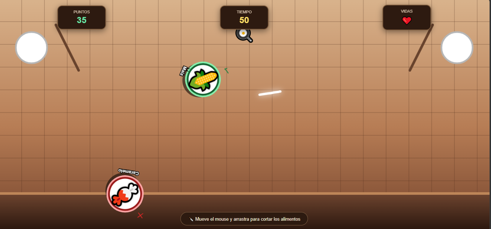

# 🍎 TURBOPLATO – Misión Saludable

## 🎮 Descripción

TURBOPLATO – Misión Saludable es un videojuego de estilo arcade en el que el jugador debe reaccionar rápidamente para interactuar con los alimentos que aparecen en pantalla.

El objetivo es conseguir la mayor cantidad de puntos posible durante el tiempo disponible, diferenciando entre alimentos saludables y alimentos no saludables.

## 🎯 Objetivo

Conseguir la mayor puntuación posible antes de que termine el tiempo, interactuando correctamente con los alimentos que aparecen durante la partida.

## 🕹️ Mecánica principal

- Los alimentos aparecen en diferentes posiciones de la pantalla.
- El jugador debe interactuar rápidamente con ellos.
- Los alimentos saludables permiten obtener puntos.
- Los alimentos no saludables reducen la puntuación y pueden hacer perder vidas.
- La partida tiene un tiempo limitado.
- El jugador debe intentar conseguir la mayor puntuación posible.

## 🎨 Género

**Arcade / Acción**

## 💻 Tecnologías utilizadas

- HTML5
- CSS3
- JavaScript

## 🎮 Controles

**Mouse:** utilizar el cursor para interactuar con los alimentos que aparecen en pantalla.

## 🏆 Sistema de puntuación

- Alimento saludable: **+10 puntos**
- Alimento no saludable: **-15 puntos**
- Alimento no saludable: **pérdida de una vida**

## ⏱️ Duración

La partida tiene una duración limitada y el jugador debe conseguir la mayor puntuación posible antes de que finalice el tiempo.
## 📸 Captura de pantalla

